# 区块链与数字货币实验一报告

日期：2026 年 5 月 31 日

## 1 实验基础知识

### 1.1 图数据库简介

图数据库是一类以“顶点”和“边”为核心组织数据的数据库，适合表示实体之间的复杂关系。与传统关系型数据库侧重二维表结构不同，图数据库更强调对象之间的连接关系，常用于金融风控、社交网络、知识图谱、推荐系统和区块链交易追踪等场景。

图数据库通常采用属性图模型。属性图由顶点、边和属性组成。顶点表示实体，边表示实体之间的关系，属性用于描述顶点或边的具体信息。在区块链交易分析中，可以将交易、地址、区块等对象建模为顶点，将转账、输入输出关系等建模为边，从而更直观地分析资金流向。

### 1.2 TuGraph 简介

TuGraph 是由蚂蚁集团与清华大学共同研发的高性能图数据库，支持大容量图存储、低延迟图查询和图分析能力。TuGraph 支持通过 Web 可视化界面完成图建模、数据导入和查询，也支持使用 Cypher 语言对图数据进行增删改查。

TuGraph 的核心操作包括创建图项目、定义顶点标签和边标签、导入 CSV 数据、使用 Cypher 查询图结构等。本实验主要使用 TuGraph Web 管理界面完成 Transactions Dataset 的图建模与数据导入，并设计 Cypher 查询语句验证导入结果。

### 1.3 数据集准备

本实验使用 Elliptic++ Transactions Dataset。该数据集来自 Bitcoin 区块链交易网络，用于研究交易之间的资金流关系及非法交易识别问题。本实验使用其中的两个文件：`elliptic_txs_classes.csv` 和 `elliptic_txs_edgelist.csv`。两个数据文件的作用和字段如表 1-1 所示。

<p align="center">表 1-1 数据集文件说明</p>

<div align="center">
<table>
  <tr>
    <th>文件名</th>
    <th>数据含义</th>
    <th>字段</th>
  </tr>
  <tr>
    <td><code>elliptic_txs_classes.csv</code></td>
    <td>交易节点及类别标签</td>
    <td><code>txId</code>、<code>class</code></td>
  </tr>
  <tr>
    <td><code>elliptic_txs_edgelist.csv</code></td>
    <td>交易之间的有向资金流边</td>
    <td><code>txId1</code>、<code>txId2</code></td>
  </tr>
</table>
</div>

根据本地 CSV 文件统计，数据集规模如表 1-2 所示。

<p align="center">表 1-2 数据集规模统计</p>

<div align="center">
<table>
  <tr>
    <th>统计项</th>
    <th>数量</th>
  </tr>
  <tr>
    <td>交易节点数</td>
    <td align="right">203,769</td>
  </tr>
  <tr>
    <td>资金流边数</td>
    <td align="right">234,355</td>
  </tr>
  <tr>
    <td>非法交易数（<code>class = 1</code>）</td>
    <td align="right">4,545</td>
  </tr>
  <tr>
    <td>合法交易数（<code>class = 2</code>）</td>
    <td align="right">42,019</td>
  </tr>
  <tr>
    <td>未知交易数（<code>class = unknown</code>）</td>
    <td align="right">157,205</td>
  </tr>
</table>
</div>

结合表 1-1 和表 1-2，本实验将每一笔交易建模为一个 `BitcoinTx` 顶点，使用交易编号 `txId` 作为主键，使用 `class` 表示交易类别；将交易之间的资金流关系建模为 `TRANSFER_TO` 有向边，边的起点为 `txId1`，终点为 `txId2`。

## 2 启动 TuGraph 平台

### 2.1 阿里云 TuGraph 服务准备

本实验使用阿里云计算巢中的 TuGraph 免费试用服务启动平台。首先登录阿里云账号，进入控制台，在“计算巢”中查找 TuGraph 服务并创建试用服务实例。创建实例时按照页面提示完成地域、实例规格、访问密码等参数配置。创建实例成功界面如图 2-1 所示。

<div align="center">
  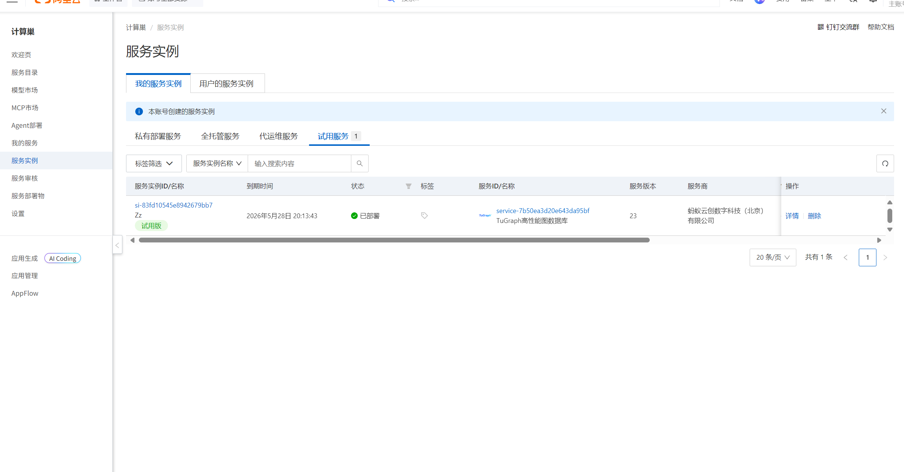
</div>

<p align="center">图 2-1 TuGraph 创建实例成功界面</p>

服务实例创建完成后，在阿里云控制台进入“计算巢 -> 服务实例”，打开对应 TuGraph 实例详情页面，查看实例提供的用户名、密码、Browser 地址和 Bolt 地址等信息。

### 2.2 登录 TuGraph Web 界面

在实例详情页获取 TuGraph Browser 访问地址后，使用浏览器打开该地址。根据阿里云实例详情页提供的账号信息登录 TuGraph Web 管理界面。登录成功后，可以看到 TuGraph 的图项目管理、图构建、数据导入和查询等功能模块。登录成功界面如图 2-2 所示。

<div align="center">
  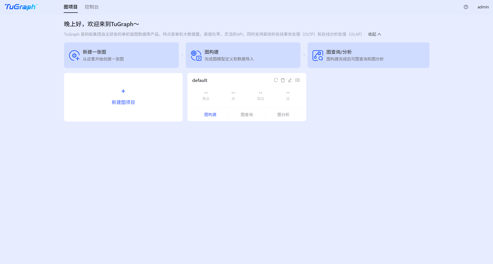
</div>

<p align="center">图 2-2 TuGraph 登录成功界面</p>

### 2.3 启动过程总结

本次实验的 TuGraph 启动流程如下：

1. 登录阿里云控制台。
2. 进入“计算巢”并创建 TuGraph 免费试用服务实例。
3. 等待实例部署完成。
4. 在服务实例详情页查看 TuGraph Browser 地址、Bolt 地址、用户名和密码。
5. 使用浏览器访问 TuGraph Browser 地址。
6. 输入账号和密码，进入 TuGraph Web 管理界面。

## 3 Transactions Dataset 图建模与数据导入

### 3.1 图模型设计

根据表 1-1 中的字段，顶点标签设计如表 3-1 所示。

<p align="center">表 3-1 顶点标签设计</p>

<div align="center">
<table>
  <tr>
    <th>顶点标签</th>
    <th>含义</th>
    <th>属性</th>
    <th>主键</th>
  </tr>
  <tr>
    <td><code>BitcoinTx</code></td>
    <td>一笔 Bitcoin 交易</td>
    <td><code>txId</code>、<code>class</code></td>
    <td><code>txId</code></td>
  </tr>
</table>
</div>

边标签设计如表 3-2 所示。

<p align="center">表 3-2 边标签设计</p>

<div align="center">
<table>
  <tr>
    <th>边标签</th>
    <th>起点</th>
    <th>终点</th>
    <th>含义</th>
  </tr>
  <tr>
    <td><code>TRANSFER_TO</code></td>
    <td><code>BitcoinTx</code></td>
    <td><code>BitcoinTx</code></td>
    <td>一笔交易的输出资金流向另一笔交易的输入</td>
  </tr>
</table>
</div>

本实验将 `txId` 设置为 `STRING` 类型并作为主键；`class` 设置为 `STRING` 类型，以兼容 `1`、`2` 和 `unknown` 三类标签，而 `TRANSFER_TO` 是从一个 `BitcoinTx` 顶点指向另一个 `BitcoinTx` 顶点的有向边。

### 3.2 可视化建模步骤

进入 TuGraph Web 管理界面后，新建图项目，并在“图构建”中完成如下操作：

1. 添加点类型，名称设置为 `BitcoinTx`。
2. 为 `BitcoinTx` 添加属性 `txId`，类型设置为 `STRING`，并设置为主键。
3. 为 `BitcoinTx` 添加属性 `class`，类型设置为 `STRING`。
4. 添加边类型，名称设置为 `TRANSFER_TO`。
5. 设置 `TRANSFER_TO` 的起点为 `BitcoinTx`，终点为 `BitcoinTx`。
6. 保存图模型。

以上建模过程对应表 3-1 和表 3-2 中的顶点、边及属性设计。建模截图见图 3-1 与图 3-2，建模后的图模型见图 3-3。

<div align="center">
  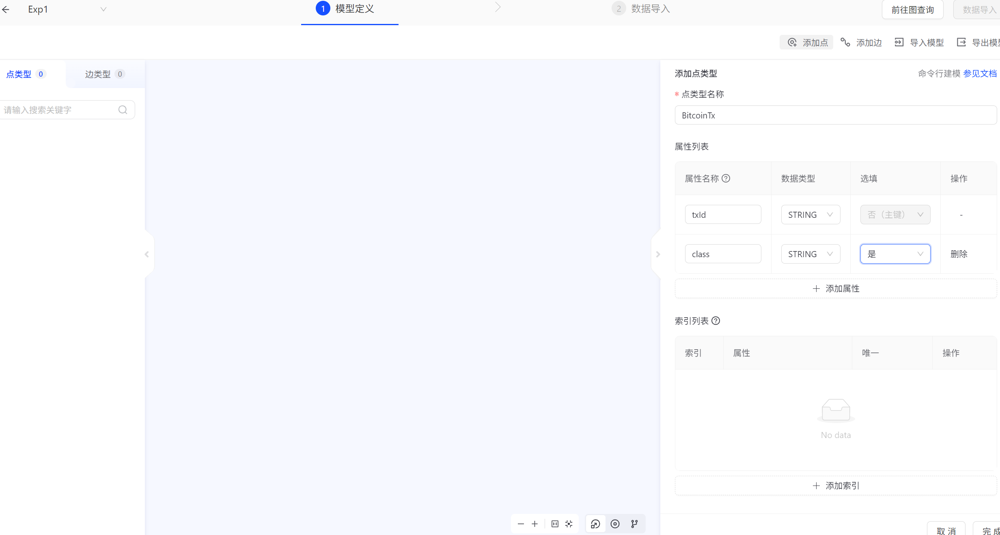
</div>

<p align="center">图 3-1 建模顶点示意图</p>

<div align="center">
  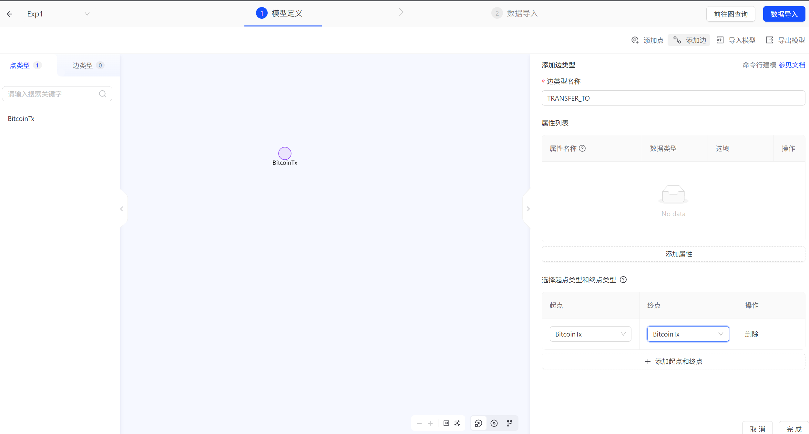
</div>

<p align="center">图 3-2 建模边示意图</p>

<div align="center">
  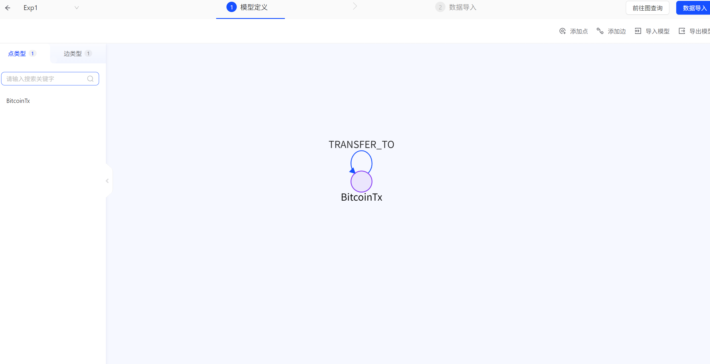
</div>

<p align="center">图 3-3 图模型示意图</p>

### 3.3 数据导入步骤

在 TuGraph Web 管理界面进入数据导入页面后，先导入点数据，再导入边数据。

点数据导入步骤如下：

1. 选择点数据导入区域，上传 `elliptic_txs_classes.csv`。
2. 标签选择 `BitcoinTx`。
3. 将 CSV 中的 `txId` 列映射到 `BitcoinTx.txId`。
4. 将 CSV 中的 `class` 列映射到 `BitcoinTx.class`。
5. 执行导入并等待任务完成。

导入成功后，TuGraph 中包含 203,769 个 `BitcoinTx` 节点，点导入与点导入成功界面分别如图 3-4，图 3-5 所示。

<div align="center">
  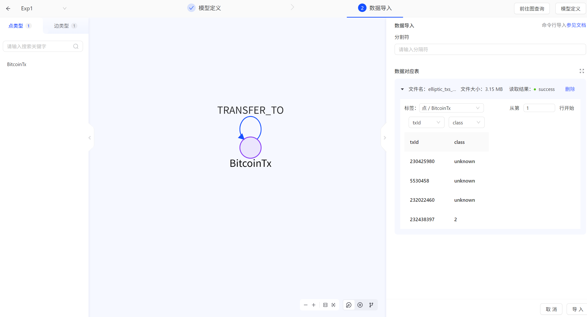
</div>

<p align="center">图 3-4 点数据导入界面</p>

<div align="center">
  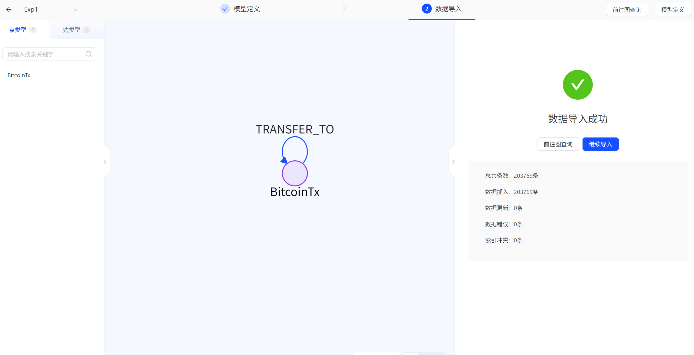
</div>

<p align="center">图 3-5 点数据导入成功界面</p>

边数据导入步骤如下：

1. 选择边数据导入区域，上传 `elliptic_txs_edgelist.csv`。
2. 标签选择 `TRANSFER_TO`。
3. 将 `txId1` 映射为边的起点 ID。
4. 将 `txId2` 映射为边的终点 ID。
5. 执行导入并等待任务完成。

导入成功后，TuGraph 中包含 234,355 条 `TRANSFER_TO` 边。边导入与边导入成功界面分别如图 3-6，图 3-7 所示。

<div align="center">
  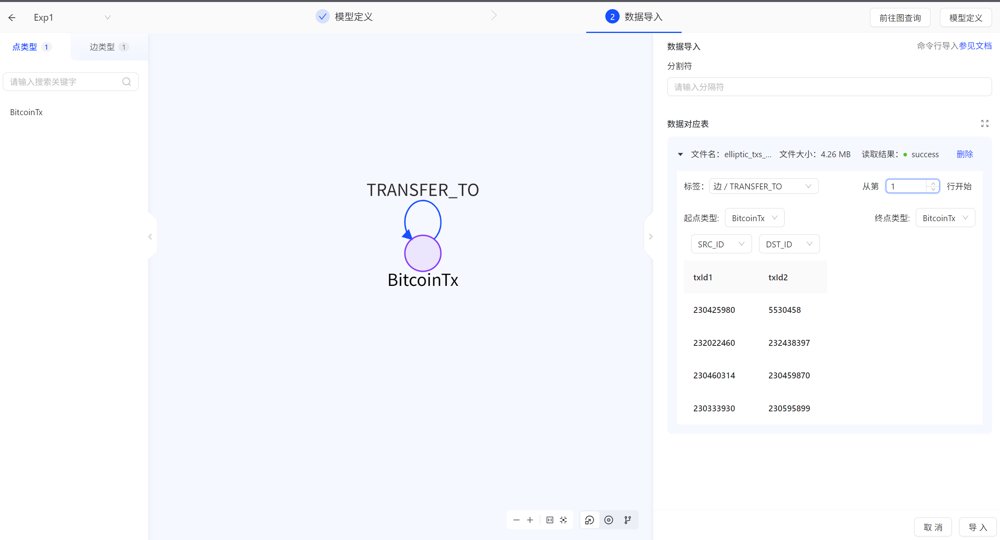
</div>

<p align="center">图 3-6 边数据导入界面</p>

<div align="center">
  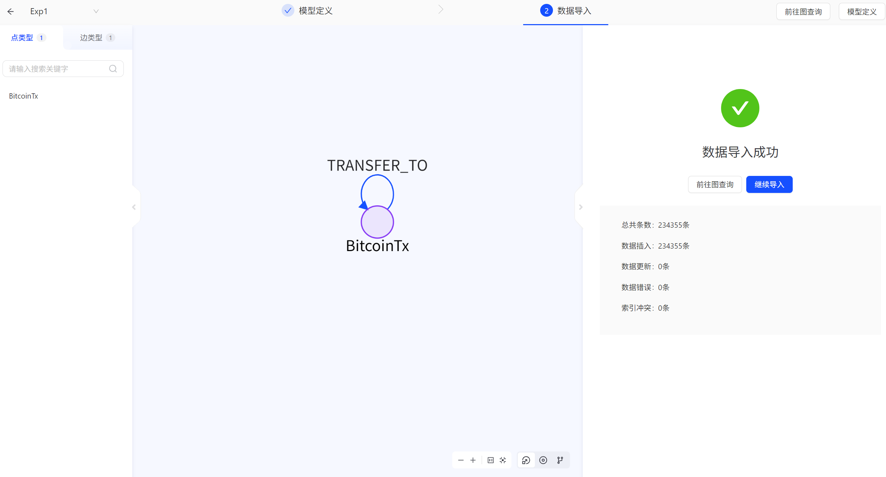
</div>

<p align="center">图 3-7 边数据导入成功界面</p>


## 4 Cypher 查询示例

### 4.1 基础查询示例

查询前 20 个非法交易节点：

```cypher
MATCH (t:BitcoinTx)
WHERE t.class = '1'
RETURN t.txId, t.class
LIMIT 20
```

该语句从 `BitcoinTx` 节点中筛选 `class = '1'` 的交易，即非法交易，并返回交易编号和类别。根据表 1-2，非法交易节点共有 4,545 个，因此该查询可以返回其中的前 20 个样本。查询结果见图 4-1。

<div align="center">
  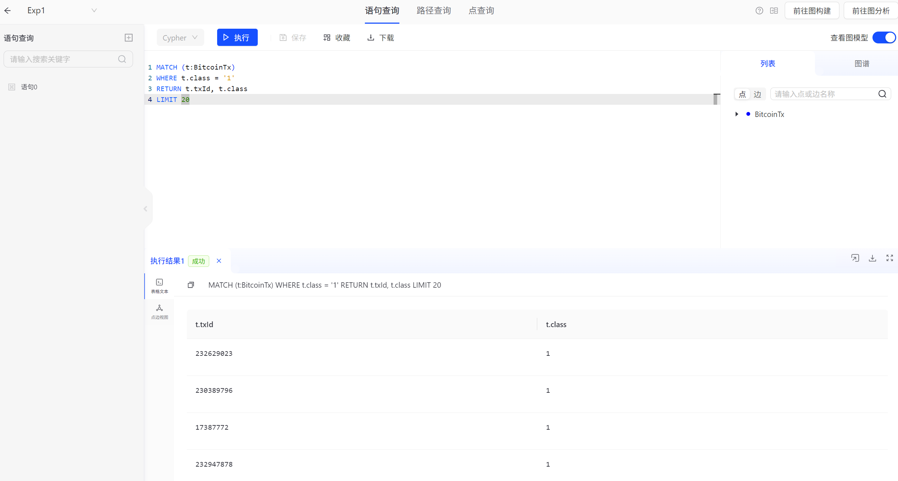
</div>

<p align="center">图 4-1 非法交易节点查询结果</p>

### 4.2 复杂查询示例

统计不同交易类别的交易数量，并按数量从高到低排序：

```cypher
MATCH (t:BitcoinTx)
RETURN t.class AS tx_class, count(t) AS tx_count
ORDER BY tx_count DESC
```

该语句使用聚合函数 `count()` 对不同类别的交易进行分组统计。根据表 1-2，本实验数据的理论统计结果应包括 `unknown`、`2`、`1` 三类，其中未知交易数量最多。查询结果见图 4-2。

<div align="center">
  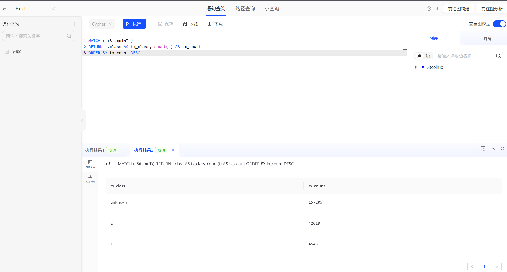
</div>

<p align="center">图 4-2 交易类别统计查询结果</p>

## 5 实验总结

通过本次实验，我了解了图数据库的基本概念，掌握了 TuGraph 的启动、登录、图建模、数据导入和 Cypher 查询操作。相比传统表结构，图数据库能够更直观地表达 Bitcoin 交易之间的资金流关系。将交易作为顶点、将资金流作为有向边之后，可以方便地查询非法交易、交易类别分布以及非法交易相关的一跳关系。

本实验的数据集说明与规模统计见表 1-1 和表 1-2，图模型设计见表 3-1 和表 3-2，阿里云 TuGraph 平台启动与登录结果见图 2-1 和图 2-2，建模和导入过程见图 3-1 至图 3-7，Cypher 查询结果见图 4-1 和图 4-2。