# 区块链与数字货币实验二报告

## 基于 PageRank 的比特币交易网络核心交易识别

日期：2026 年 6 月 6 日

## 1 实验背景与问题设计

### 1.1 实验背景

本次实验使用 Elliptic 比特币交易数据集。该数据集来自真实的 Bitcoin 交易网络，包含交易节点、交易类别标签以及交易之间的有向资金流关系。Elliptic 数据集具有明显的区块链金融分析意义，适合研究交易网络中的资金流向、核心交易、异常交易和风险扩散。

### 1.2 实验问题

本实验设计的问题是：

**在比特币交易网络中，如何利用 PageRank 算法识别处于资金流核心位置的交易，并分析这些核心交易与非法交易风险之间的关系？**

具体来说，本实验将每一笔比特币交易建模为一个节点，将交易之间的资金流向建模为有向边。如果交易 A 的输出流向交易 B 的输入，则建立一条从 A 指向 B 的边。这样可以形成一个有向交易网络。

在该网络中，PageRank 得分较高的交易节点表示它不仅接收了较多交易流入，而且这些流入交易本身也可能处于较重要的位置。因此，高 PageRank 节点可以被理解为资金流网络中的“核心汇聚交易”或“重要中转交易”。本实验希望通过 PageRank 排名回答以下问题：

1. 哪些交易在比特币交易网络中处于结构中心位置？
2. 高 PageRank 交易主要属于合法、非法还是未知类别？
3. 如果非法交易具有较高 PageRank，它在风险识别中有什么意义？
4. PageRank 这种中心性算法能否为区块链交易风控提供辅助线索？

### 1.3 问题的实际意义

比特币网络中的交易数量巨大，单笔交易本身的信息有限，仅凭交易 ID 和类别标签很难直接判断它在整个资金流网络中的作用。图算法可以利用交易之间的连接关系，从网络结构角度发现传统表格统计难以看到的信息。

本实验选择 PageRank 算法具有以下实际意义。

第一，PageRank 可以识别资金流网络中的核心交易。在交易网络中，一个交易如果接收了来自多个重要交易的资金流，那么它可能是资金汇聚、资金中转或关键清算节点。识别这些节点有助于理解资金在链上的流动结构。

第二，PageRank 可以辅助区块链反洗钱分析。非法资金往往不会孤立存在，而是通过多次转移、拆分、合并、混币或中转隐藏来源。如果某些非法交易在网络中具有较高 PageRank，说明它们不仅是非法标签节点，而且处于较重要的资金流位置，应当被重点关注。

第三，PageRank 可以为未知交易风险排序提供参考。Elliptic 数据集中大量交易的类别为 `unknown`。这些未知交易并不能直接判断合法或非法，但如果某些未知交易具有很高 PageRank，并且与已知非法交易存在路径关系，那么它们可能具有较高的进一步审查价值。

第四，PageRank 可以弥补简单入度统计的不足。入度只能表示一个交易接收了多少上游交易，而 PageRank 还会考虑上游交易自身的重要性。也就是说，来自一个核心交易的流入和来自一个边缘交易的流入，在 PageRank 中具有不同影响。这更符合真实金融网络中“资金来源质量不同”的特点。

因此，本实验不仅是一次图中心性算法实验，也可以看作区块链交易风控场景中的一次基础探索：利用图结构识别交易网络中的关键节点，为后续的异常检测、风险传播分析和链上资金追踪提供参考。

## 2 数据集说明

### 2.1 数据来源

本实验使用 Elliptic 比特币交易数据集，主要包含两个 CSV 文件：

<p align="center">表 2-1 数据文件说明</p>

<div align="center">
<table>
  <tr>
    <th>文件名</th>
    <th>含义</th>
    <th>字段</th>
  </tr>
  <tr>
    <td><code>elliptic_txs_classes.csv</code></td>
    <td>交易节点及其类别标签</td>
    <td><code>txId</code>、<code>class</code></td>
  </tr>
  <tr>
    <td><code>elliptic_txs_edgelist.csv</code></td>
    <td>交易之间的有向资金流关系</td>
    <td><code>txId1</code>、<code>txId2</code></td>
  </tr>
</table>
</div>

其中，`class` 字段含义如下：

```text
1：非法交易
2：合法交易
unknown：未知类别交易
```

### 2.2 数据规模

根据实验一数据集文件及 TuGraph 导入验证结果，数据集规模如下：

<p align="center">表 2-2 数据集规模</p>

<div align="center">
<table>
  <tr>
    <th>统计项</th>
    <th>数量</th>
  </tr>
  <tr>
    <td>交易节点数</td>
    <td align="right">203,769</td>
  </tr>
  <tr>
    <td>资金流边数</td>
    <td align="right">234,355</td>
  </tr>
  <tr>
    <td>非法交易数（<code>class = 1</code>）</td>
    <td align="right">4,545</td>
  </tr>
  <tr>
    <td>合法交易数（<code>class = 2</code>）</td>
    <td align="right">42,019</td>
  </tr>
  <tr>
    <td>未知交易数（<code>class = unknown</code>）</td>
    <td align="right">157,205</td>
  </tr>
</table>
</div>

该数据集的特点是未知类别交易数量最多，非法交易数量较少，但非法交易是区块链风控分析中最值得关注的部分，而 PageRank 计算可以帮助从大量交易中筛选出结构上更重要的节点。

## 3 图数据建模与导入

### 3.1 创建 TuGraph 服务实例

创建 TuGraph 服务实例的操作步骤如下：

1. 登录阿里云控制台。
2. 进入计算巢或 TuGraph 服务页面。
3. 申请 TuGraph 试用服务实例。
4. 等待服务部署完成。
5. 在服务实例详情页查看 Browser 地址、Bolt 地址、用户名和密码。
6. 使用浏览器打开 TuGraph Browser 地址并登录。

<div align="center">
  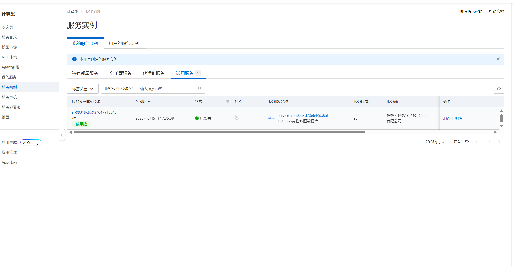
</div>

<p align="center">图 3-1 TuGraph 服务实例创建成功</p>

<div align="center">
  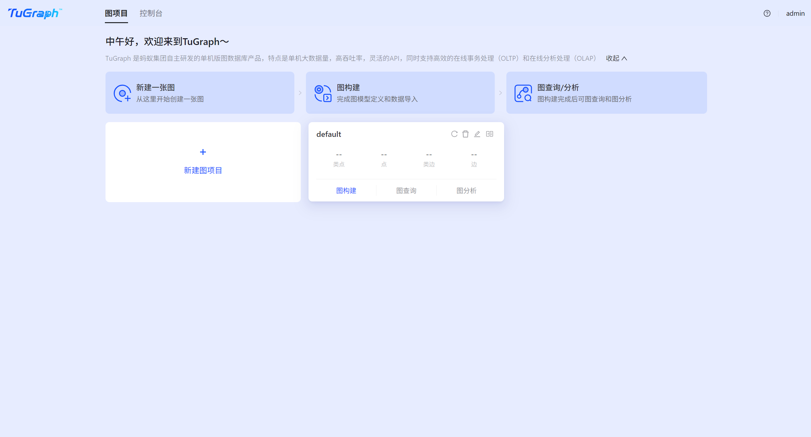
</div>

<p align="center">图 3-2 TuGraph Browser 登录成功</p>

### 3.2 图模型设计

结合数据集的数据结构，本实验采用交易级图模型。

顶点设计如下：

<p align="center">表 3-1 顶点标签设计</p>

<div align="center">
<table>
  <tr>
    <th>顶点标签</th>
    <th>含义</th>
    <th>属性</th>
    <th>主键</th>
  </tr>
  <tr>
    <td><code>BitcoinTx</code></td>
    <td>一笔比特币交易</td>
    <td><code>txId</code>、<code>class</code></td>
    <td><code>txId</code></td>
  </tr>
</table>
</div>

边设计如下：

<p align="center">表 3-2 边标签设计</p>

<div align="center">
<table>
  <tr>
    <th>边标签</th>
    <th>起点</th>
    <th>终点</th>
    <th>含义</th>
  </tr>
  <tr>
    <td><code>TRANSFER_TO</code></td>
    <td><code>BitcoinTx</code></td>
    <td><code>BitcoinTx</code></td>
    <td>一笔交易的输出资金流向另一笔交易的输入</td>
  </tr>
</table>
</div>

本实验将 `txId` 设置为 `STRING` 类型并作为主键，将 `class` 设置为 `STRING` 类型，以兼容 `1`、`2` 和 `unknown` 三种类别。`TRANSFER_TO` 是有向边，方向从 `txId1` 指向 `txId2`。在 PageRank 语义中，资金流从上游交易流向下游交易，得分较高的节点代表接收了较多重要上游资金流的交易。

### 3.3 建模操作

在 TuGraph Web 管理界面中完成如下操作：

1. 新建图项目。
2. 在图构建页面添加顶点类型 `BitcoinTx`。
3. 为 `BitcoinTx` 添加属性 `txId`，类型为 `STRING`，设置为主键。
4. 为 `BitcoinTx` 添加属性 `class`，类型为 `STRING`。
5. 添加边类型 `TRANSFER_TO`。
6. 设置 `TRANSFER_TO` 的起点和终点均为 `BitcoinTx`。
7. 保存图模型。

<div align="center">
  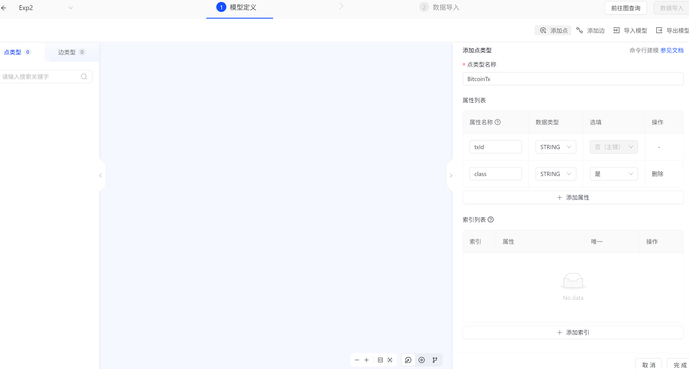
</div>

<p align="center">图 3-3 BitcoinTx 顶点建模</p>

<div align="center">
  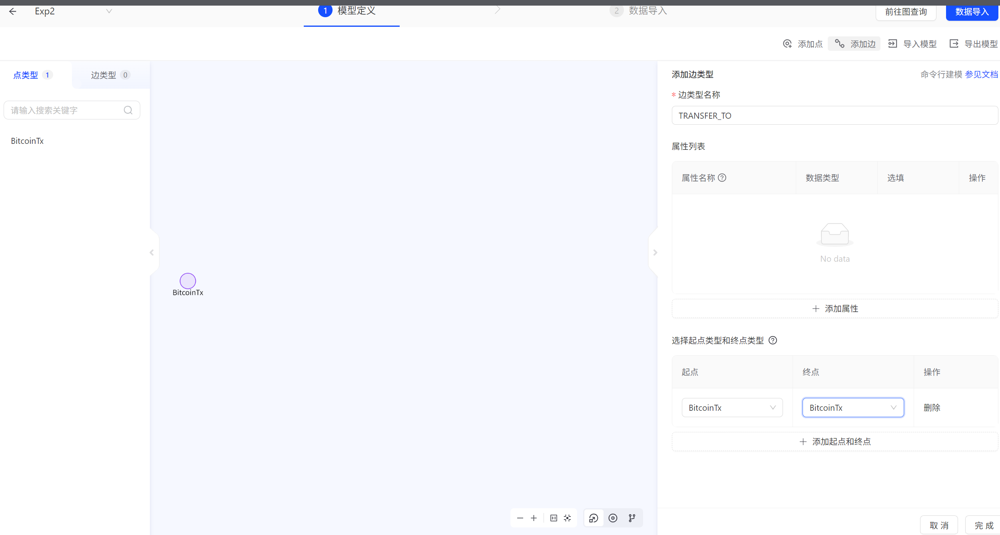
</div>

<p align="center">图 3-4 TRANSFER_TO 边建模</p>

<div align="center">
  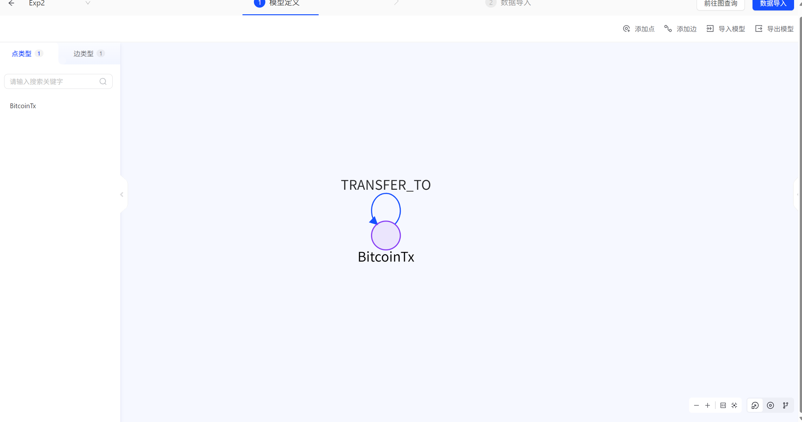
</div>

<p align="center">图 3-5 比特币交易图模型</p>

### 3.4 数据导入

先导入点数据，再导入边数据。

点数据导入步骤：

1. 上传 `elliptic_txs_classes.csv`。
2. 选择顶点标签 `BitcoinTx`。
3. 将 CSV 中的 `txId` 映射到 `BitcoinTx.txId`。
4. 将 CSV 中的 `class` 映射到 `BitcoinTx.class`。
5. 执行导入任务并等待完成。

边数据导入步骤：

1. 上传 `elliptic_txs_edgelist.csv`。
2. 选择边标签 `TRANSFER_TO`。
3. 将 `txId1` 映射为边的起点 ID。
4. 将 `txId2` 映射为边的终点 ID。
5. 执行导入任务并等待完成。

<div align="center">
  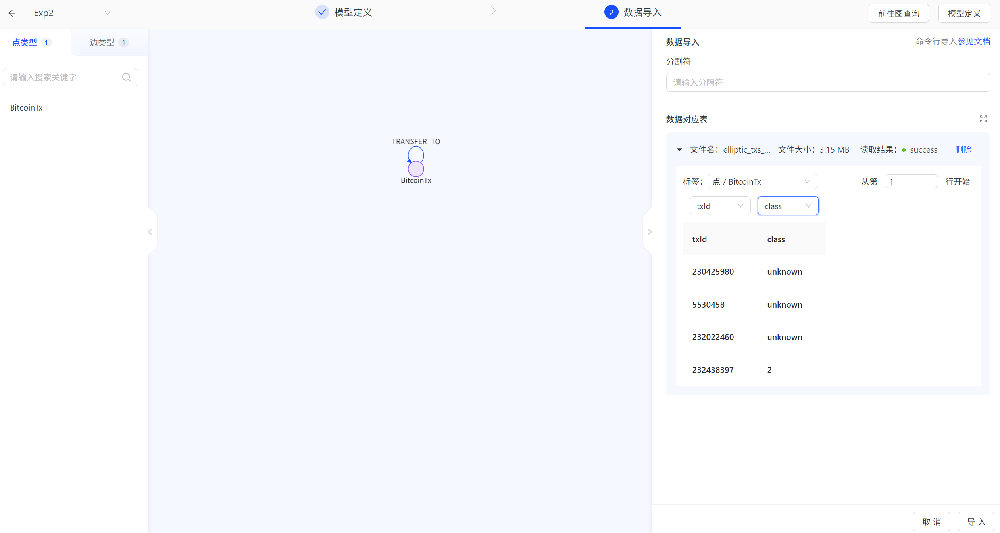
</div>

<p align="center">图 3-6 点数据导入配置</p>

<div align="center">
  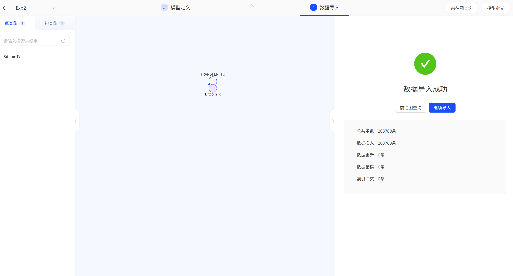
</div>

<p align="center">图 3-7 点数据导入成功</p>

<div align="center">
  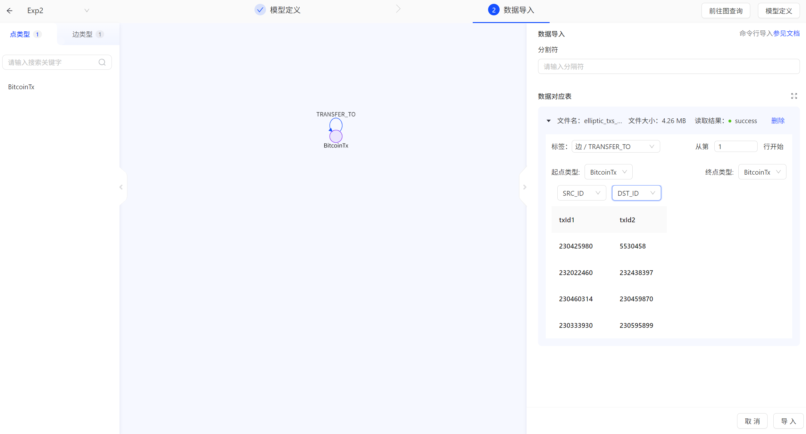
</div>

<p align="center">图 3-8 边数据导入配置</p>

<div align="center">
  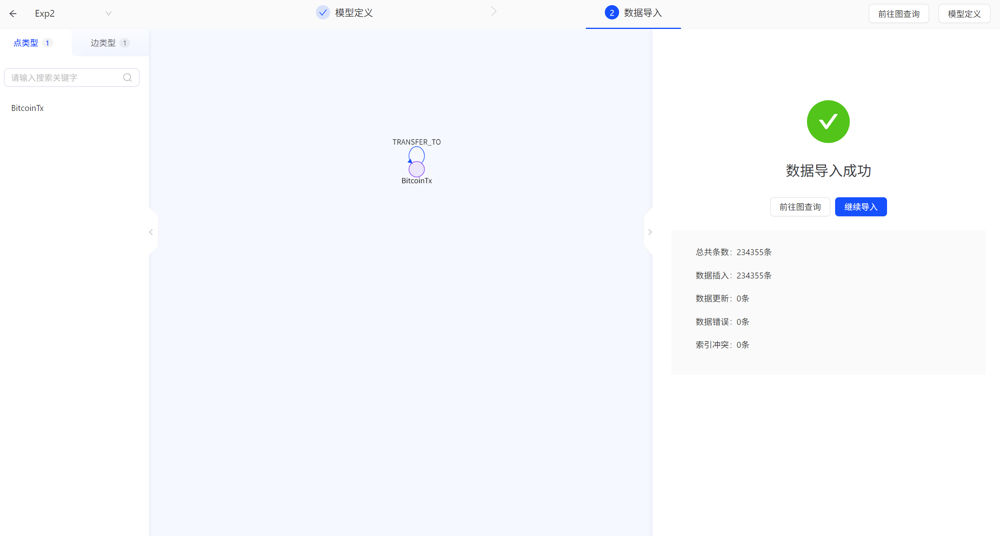
</div>

<p align="center">图 3-9 边数据导入成功</p>

### 3.5 数据导入验证

导入完成后，可以使用 Cypher 查询验证节点和边数量。

查询交易节点数量：

```cypher
MATCH (t:BitcoinTx)
RETURN count(t) AS tx_count;
```

查询资金流边数量：

```cypher
MATCH (:BitcoinTx)-[r:TRANSFER_TO]->(:BitcoinTx)
RETURN count(r) AS edge_count;
```

查询不同类别交易数量：

```cypher
MATCH (t:BitcoinTx)
RETURN t.class AS tx_class, count(t) AS tx_count
ORDER BY tx_count DESC;
```

<div align="center">
  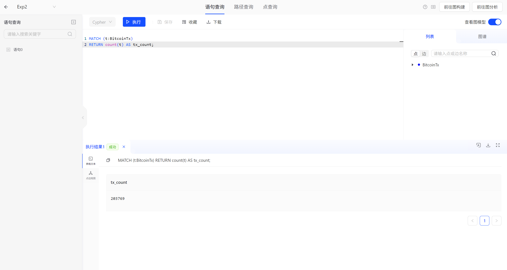
</div>

<p align="center">图 3-10 节点数量验证</p>

<div align="center">
  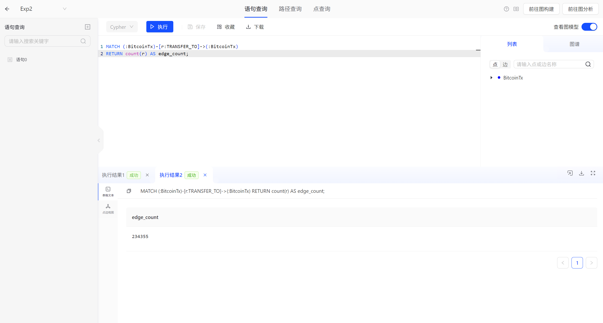
</div>

<p align="center">图 3-11 边数量验证</p>

<div align="center">
  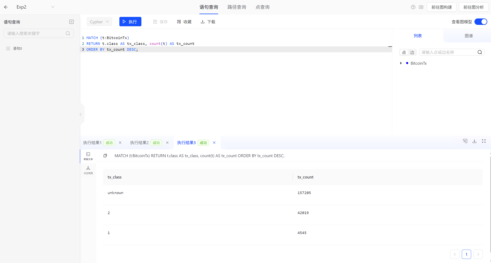
</div>

<p align="center">图 3-12 交易类别统计</p>

## 4 PageRank 算法原理

### 4.1 中心性算法

中心性算法用于衡量图中节点的重要程度。不同中心性算法对“重要”的理解不同。度中心性关注连接数量，介数中心性关注节点是否位于路径中间，接近中心性关注节点到其他节点的距离，而 PageRank 关注的是链接关系中的重要性传递。

在本实验的比特币交易图中，节点是交易，边是资金流。PageRank 得分高的交易表示它在资金流网络中接收了较多来自重要上游交易的影响，因此可以被视为核心交易节点。

### 4.2 PageRank 基本思想

PageRank 最初用于网页排序，其思想可以迁移到交易网络中。

在网页网络中，一个网页如果被很多重要网页链接，则该网页也重要。在交易网络中，一个交易如果接收了很多重要交易的资金流，则该交易在资金流结构中也重要。

可以将 PageRank 理解为一种“重要性沿边传播”的过程：

1. 初始时，每个交易节点的重要性相同。
2. 每个交易节点将自己的重要性沿 `TRANSFER_TO` 出边分配给下游交易。
3. 下游交易接收来自多个上游交易的重要性贡献。
4. 重复迭代后，重要性分布趋于稳定。
5. 稳定后得分较高的交易就是网络中的核心交易。

### 4.3 计算公式

对于交易节点 v，其 PageRank 值可以表示为：

```text
PR(v) = (1 - d) / N + d * Σ(PR(u) / OutDegree(u))
```

其中：

```text
PR(v)：交易 v 的 PageRank 得分
d：阻尼系数，本实验取 0.85
N：图中交易节点总数
u：所有指向 v 的上游交易
OutDegree(u)：上游交易 u 的出度
```

公式第一部分：

```text
(1 - d) / N
```

表示随机跳转到任意交易节点的概率。

公式第二部分：

```text
d * Σ(PR(u) / OutDegree(u))
```

表示从上游交易沿资金流边传递到当前交易的重要性。

### 4.4 阻尼系数与悬挂节点

本实验使用常见阻尼系数：

```text
damping = 0.85
```

它表示 85% 的重要性沿资金流方向传播，15% 的重要性随机分配到全图节点。这样可以避免算法陷入局部结构。

在比特币交易图中，很多交易可能没有出边，即资金流在数据集中没有继续流向其他交易。这类节点称为悬挂节点。如果不处理悬挂节点，它们的 PageRank 权重会在迭代过程中丢失。本实验的存储过程将悬挂节点的权重平均分配给所有节点，从而保持总权重稳定。

### 4.5 本实验中的 PageRank 解释

在本实验中，边方向为：

```text
txId1 -> txId2
```

表示资金流从交易 `txId1` 流向交易 `txId2`。因此，PageRank 得分较高的交易通常具有以下特征：

1. 入边较多，接收了多个上游交易的资金流。
2. 上游交易本身也较重要。
3. 可能处于资金汇聚、资金中转或交易网络关键位置。
4. 如果类别为 `1`，说明该非法交易在结构上更值得关注。
5. 如果类别为 `unknown`，说明该未知交易可能需要进一步风险审查。

需要注意的是，PageRank 只能说明结构重要性，不能单独证明某笔交易一定非法。它更适合作为风险排序和线索发现工具，与交易类别、路径关系、金额、时间、地址特征等信息结合使用。

## 5 存储过程设计与修改

### 5.1 存储过程修改

本实验对存储过程 `ceshi_pagerank.py` 进行了修改，使其更适合 `BitcoinTx` 数据模型。主要修改点如下：

1. 默认最大迭代次数从 20 调整为 50，更适合较大规模交易图。
2. 返回结果中增加交易主键 `txId`。
3. 返回结果中增加交易类别 `class`，便于区分合法、非法和未知交易。
4. 返回结果中增加 `inDegree` 和 `outDegree`，便于解释节点为什么 PageRank 较高。
5. 返回 JSON 格式结果，包含节点总数、实际迭代次数、收敛差异值和 Top-K 排名。

### 5.2 存储过程完整代码

代码文件见：`src/ceshi_pagerank.py`

### 5.3 代码逻辑说明

第一步，解析输入参数：

```python
max_iter = int(data.get("max_iter", 50))
damping = float(data.get("damping", 0.85))
top_k = int(data.get("top_k", 20))
```

其中，`max_iter` 表示最大迭代次数，`damping` 表示阻尼系数，`top_k` 表示返回排名前多少个交易节点。

第二步，创建只读事务：

```python
txn = db.CreateReadTxn()
```

PageRank 只读取图数据，不修改数据库，因此使用只读事务。

第三步，收集交易节点、交易属性和度数信息：

```python
tx_id = str(it.GetField("txId"))
tx_class = str(it.GetField("class"))
```

这样可以在最终结果中返回可解释的交易编号和类别，而不是只返回内部顶点 ID。

第四步，初始化 PageRank：

```python
pr = {vid: 1.0 / node_count for vid in vids}
```

初始时每个交易节点的重要性相同。

第五步，沿资金流边迭代传播重要性：

```python
contrib = pr[vid] * damping / out_deg[vid]
new_pr[dst] += contrib
```

如果一个交易有多个下游交易，则它的 PageRank 值会平均分配给这些下游交易。

第六步，处理悬挂节点：

```python
dangling_mass = sum(pr[vid] for vid in vids if out_deg[vid] == 0) * damping
equal_share = dangling_mass / node_count
```

没有出边的交易节点会将权重平均分配给所有节点，避免权重丢失。

第七步，排序并返回结果：

```python
top_result = sorted(pr.items(), key=lambda x: x[1], reverse=True)[:top_k]
```

最终返回排名、交易 ID、类别、PageRank 分数、入度和出度。

## 6 PageRank 过程上传与运行

### 6.1 更改 `--enable_plugin` 参数

TuGraph 出于安全考虑默认未开启存储过程插件功能，因此在上传和运行 Python 存储过程之前，需要先在服务端开启 `enable_plugin` 参数。本实验的 TuGraph 服务通过阿里云计算巢创建，底层以 Docker 容器方式运行，容器名称为 `tugraph_demo`。

首先通过服务实例详情页面中的 ssh 字段登录阿里云 ECS 实例，在终端中查看 TuGraph 容器运行状态：

```bash
docker ps --filter name=tugraph_demo --format 'table {{.Names}}\t{{.Status}}\t{{.Image}}\t{{.Ports}}'
```

可以看到 `tugraph_demo` 容器处于运行状态，说明 TuGraph 服务已经正常启动。随后备份原始配置文件，避免配置修改错误后无法恢复：

```bash
docker exec tugraph_demo cp /usr/local/etc/lgraph.json /usr/local/etc/lgraph.json.bak
```

然后修改容器内的 TuGraph 配置文件 `/usr/local/etc/lgraph.json`，在 JSON 配置的最外层加入如下参数：

```json
"enable_plugin": true
```

本实验采用如下命令自动写入该配置项：

```bash
docker exec tugraph_demo sh -c "sed -i '\$s/}/,\n    \"enable_plugin\": true\n}/' /usr/local/etc/lgraph.json"
```

写入完成后，使用 `grep` 命令检查配置是否生效：

```bash
docker exec tugraph_demo grep -n enable_plugin /usr/local/etc/lgraph.json
```

若终端输出中出现如下内容，则说明 `enable_plugin` 参数已经成功写入配置文件：

```bash
"enable_plugin": true
```

<div align="center">
  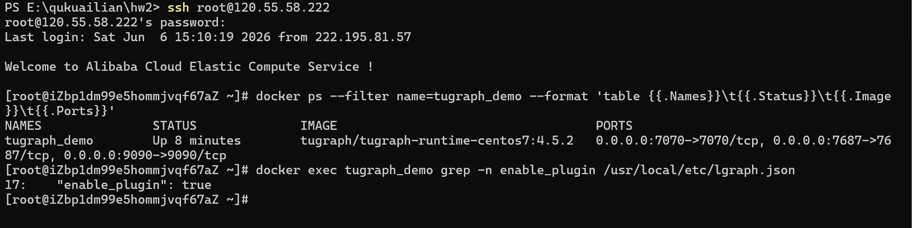
</div>

<p align="center">图 6-1 enable_plugin 参数修改成功</p>

最后，重启 TuGraph 容器，使新的配置参数生效：

```bash
docker restart tugraph_demo
```

重启完成后再次查看容器状态：

```bash
docker ps --filter name=tugraph_demo --format 'table {{.Names}}\t{{.Status}}\t{{.Ports}}'
```

如果容器状态显示为 `Up`，说明 TuGraph 服务已成功重启，`enable_plugin` 参数已经生效，然后在容器中安装 `Cython==0.29.37` 和 `g++ 8.3.1`，并配置相关环境变量和链接依赖，最后重新启动 TuGraph 服务进程：

```bash
docker exec tugraph_demo sh -c "/usr/local/bin/lgraph_server -c /usr/local/etc/lgraph.json -d start"
```

此时即可进入 TuGraph Web 管理界面继续上传和运行 PageRank 存储过程。

### 6.2 上传存储过程

在 TuGraph Web 管理界面中进入存储过程管理页面，上传 `ceshi_pagerank.py`，类型选择 Python。

<div align="center">
  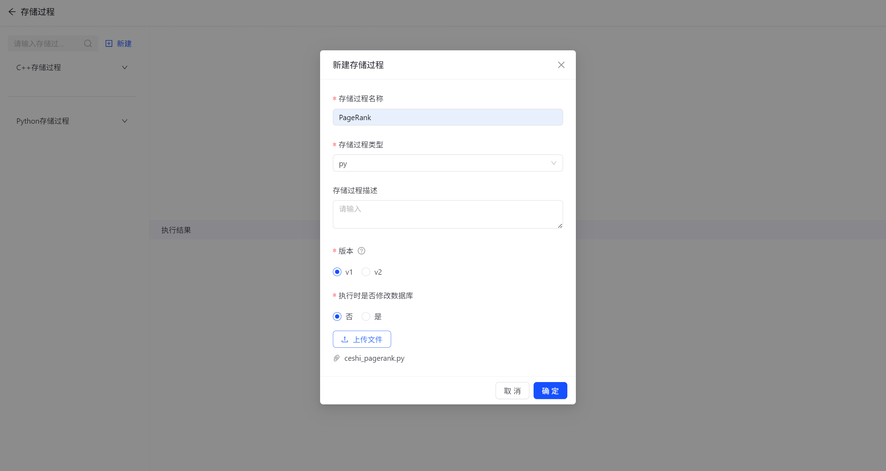
</div>

<p align="center">图 6-2 PageRank 存储过程上传</p>

<div align="center">
  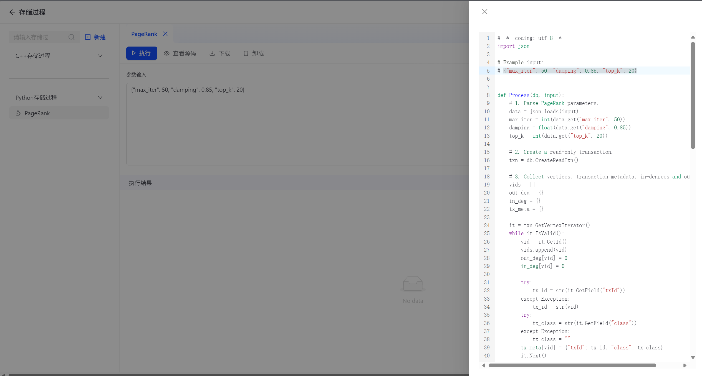
</div>

<p align="center">图 6-3 PageRank 存储过程保存成功</p>

### 6.3 运行参数

本实验主要使用如下参数运行 PageRank：

```json
{"max_iter": 50, "damping": 0.85, "top_k": 20}
```

参数解释如下：

<p align="center">表 6-1 PageRank 参数说明</p>

<div align="center">
<table>
  <tr>
    <th>参数</th>
    <th>取值</th>
    <th>含义</th>
  </tr>
  <tr>
    <td><code>max_iter</code></td>
    <td>50</td>
    <td>最大迭代次数</td>
  </tr>
  <tr>
    <td><code>damping</code></td>
    <td>0.85</td>
    <td>沿资金流继续传播重要性的概率</td>
  </tr>
  <tr>
    <td><code>top_k</code></td>
    <td>20</td>
    <td>返回 PageRank 得分最高的前 20 个交易</td>
  </tr>
</table>
</div>


## 7 实验结果

### 7.1 运行结果

点击“执行”按钮后，PageRank 存储过程成功运行。

<div align="center">
  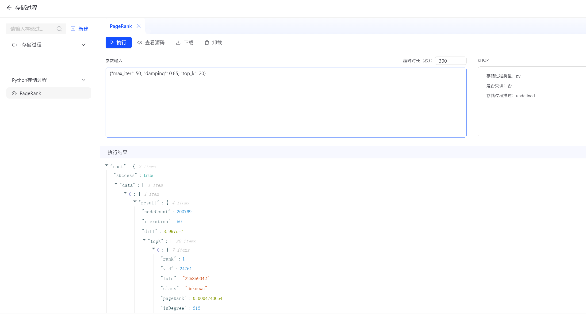
</div>

<p align="center">图 7-1 PageRank 运行成功</p>

本次运行参数为：

```json
{
  "max_iter": 50,
  "damping": 0.85,
  "top_k": 20
}
```

程序返回结果包含节点总数、实际迭代次数、最终差异值以及 PageRank 排名前 20 的交易节点。整理后的 JSON 结果如下：

```json
{
  "nodeCount": 203769,
  "iteration": 50,
  "diff": 8.997e-7,
  "topK": [
    {
      "rank": 1,
      "vid": 24761,
      "txId": "225859042",
      "class": "unknown",
      "pageRank": 0.0004743654,
      "inDegree": 212,
      "outDegree": 0
    },
    {
      "rank": 2,
      "vid": 51371,
      "txId": "43388675",
      "class": "2",
      "pageRank": 0.0004707255,
      "inDegree": 284,
      "outDegree": 0
    },
    {
      "rank": 3,
      "vid": 157798,
      "txId": "99409352",
      "class": "2",
      "pageRank": 0.000457186,
      "inDegree": 19,
      "outDegree": 0
    },
    {
      "rank": 4,
      "vid": 46397,
      "txId": "179084283",
      "class": "unknown",
      "pageRank": 0.000445885,
      "inDegree": 91,
      "outDegree": 0
    },
    {
      "rank": 5,
      "vid": 148195,
      "txId": "30276715",
      "class": "2",
      "pageRank": 0.0004206433,
      "inDegree": 129,
      "outDegree": 0
    },
    {
      "rank": 6,
      "vid": 31762,
      "txId": "121801433",
      "class": "unknown",
      "pageRank": 0.000392833,
      "inDegree": 71,
      "outDegree": 0
    },
    {
      "rank": 7,
      "vid": 174185,
      "txId": "91882349",
      "class": "2",
      "pageRank": 0.0003843487,
      "inDegree": 100,
      "outDegree": 1
    },
    {
      "rank": 8,
      "vid": 116675,
      "txId": "163832295",
      "class": "2",
      "pageRank": 0.0003571206,
      "inDegree": 36,
      "outDegree": 0
    },
    {
      "rank": 9,
      "vid": 35892,
      "txId": "96576418",
      "class": "2",
      "pageRank": 0.0003558354,
      "inDegree": 239,
      "outDegree": 0
    },
    {
      "rank": 10,
      "vid": 167220,
      "txId": "73405590",
      "class": "2",
      "pageRank": 0.0003486189,
      "inDegree": 73,
      "outDegree": 0
    },
    {
      "rank": 11,
      "vid": 31690,
      "txId": "121654821",
      "class": "unknown",
      "pageRank": 0.0003440549,
      "inDegree": 154,
      "outDegree": 2
    },
    {
      "rank": 12,
      "vid": 64727,
      "txId": "339157927",
      "class": "2",
      "pageRank": 0.0003397522,
      "inDegree": 21,
      "outDegree": 1
    },
    {
      "rank": 13,
      "vid": 154471,
      "txId": "149158766",
      "class": "2",
      "pageRank": 0.0003393022,
      "inDegree": 148,
      "outDegree": 0
    },
    {
      "rank": 14,
      "vid": 51437,
      "txId": "68705820",
      "class": "2",
      "pageRank": 0.0003381617,
      "inDegree": 247,
      "outDegree": 0
    },
    {
      "rank": 15,
      "vid": 61,
      "txId": "2758467",
      "class": "2",
      "pageRank": 0.0003344489,
      "inDegree": 106,
      "outDegree": 0
    },
    {
      "rank": 16,
      "vid": 148292,
      "txId": "30699343",
      "class": "2",
      "pageRank": 0.0003343519,
      "inDegree": 241,
      "outDegree": 0
    },
    {
      "rank": 17,
      "vid": 178098,
      "txId": "94940568",
      "class": "unknown",
      "pageRank": 0.0003283791,
      "inDegree": 1,
      "outDegree": 0
    },
    {
      "rank": 18,
      "vid": 116920,
      "txId": "163887041",
      "class": "unknown",
      "pageRank": 0.0003277651,
      "inDegree": 24,
      "outDegree": 0
    },
    {
      "rank": 19,
      "vid": 151499,
      "txId": "116179605",
      "class": "2",
      "pageRank": 0.000326197,
      "inDegree": 35,
      "outDegree": 0
    },
    {
      "rank": 20,
      "vid": 51567,
      "txId": "43397277",
      "class": "2",
      "pageRank": 0.0003051427,
      "inDegree": 182,
      "outDegree": 0
    }
  ]
}
```

### 7.2 PageRank Top-20 结果整理

将 PageRank 排名前 20 的交易整理如下：

<p align="center">表 7-1 PageRank Top-20 交易结果</p>

<div align="center">
<table>
  <tr>
    <th>排名</th>
    <th>txId</th>
    <th>类别</th>
    <th>入度</th>
    <th>出度</th>
    <th>PageRank</th>
  </tr>
  <tr><td>1</td><td>225859042</td><td>unknown</td><td>212</td><td>0</td><td>0.0004743654</td></tr>
  <tr><td>2</td><td>43388675</td><td>2</td><td>284</td><td>0</td><td>0.0004707255</td></tr>
  <tr><td>3</td><td>99409352</td><td>2</td><td>19</td><td>0</td><td>0.0004571860</td></tr>
  <tr><td>4</td><td>179084283</td><td>unknown</td><td>91</td><td>0</td><td>0.0004458850</td></tr>
  <tr><td>5</td><td>30276715</td><td>2</td><td>129</td><td>0</td><td>0.0004206433</td></tr>
  <tr><td>6</td><td>121801433</td><td>unknown</td><td>71</td><td>0</td><td>0.0003928330</td></tr>
  <tr><td>7</td><td>91882349</td><td>2</td><td>100</td><td>1</td><td>0.0003843487</td></tr>
  <tr><td>8</td><td>163832295</td><td>2</td><td>36</td><td>0</td><td>0.0003571206</td></tr>
  <tr><td>9</td><td>96576418</td><td>2</td><td>239</td><td>0</td><td>0.0003558354</td></tr>
  <tr><td>10</td><td>73405590</td><td>2</td><td>73</td><td>0</td><td>0.0003486189</td></tr>
  <tr><td>11</td><td>121654821</td><td>unknown</td><td>154</td><td>2</td><td>0.0003440549</td></tr>
  <tr><td>12</td><td>339157927</td><td>2</td><td>21</td><td>1</td><td>0.0003397522</td></tr>
  <tr><td>13</td><td>149158766</td><td>2</td><td>148</td><td>0</td><td>0.0003393022</td></tr>
  <tr><td>14</td><td>68705820</td><td>2</td><td>247</td><td>0</td><td>0.0003381617</td></tr>
  <tr><td>15</td><td>2758467</td><td>2</td><td>106</td><td>0</td><td>0.0003344489</td></tr>
  <tr><td>16</td><td>30699343</td><td>2</td><td>241</td><td>0</td><td>0.0003343519</td></tr>
  <tr><td>17</td><td>94940568</td><td>unknown</td><td>1</td><td>0</td><td>0.0003283791</td></tr>
  <tr><td>18</td><td>163887041</td><td>unknown</td><td>24</td><td>0</td><td>0.0003277651</td></tr>
  <tr><td>19</td><td>116179605</td><td>2</td><td>35</td><td>0</td><td>0.0003261970</td></tr>
  <tr><td>20</td><td>43397277</td><td>2</td><td>182</td><td>0</td><td>0.0003051427</td></tr>
</table>
</div>

从类别上看，Top-20 中合法交易 14 个，未知交易 6 个，非法交易 0 个。虽然 Top-20 中没有直接出现已标记非法交易，但出现了多个未知类别的高中心性交易，说明这些未知交易在资金流网络中具有较高结构重要性。

### 7.3 PageRank Top-100 类别分布

为了进一步观察高 PageRank 交易中的风险结构，本实验继续运行 `top_k = 100`，并对前 100 个交易按类别进行统计。统计结果如下（原始运行结果见 `results/PageRank_Top100_Result.json`）：

<p align="center">表 7-2 PageRank Top-100 类别分布</p>

<div align="center">
<table>
  <tr>
    <th>类别</th>
    <th>含义</th>
    <th>数量</th>
    <th>占比</th>
  </tr>
  <tr>
    <td><code>2</code></td>
    <td>合法交易</td>
    <td>73</td>
    <td>73%</td>
  </tr>
  <tr>
    <td><code>unknown</code></td>
    <td>未知交易</td>
    <td>20</td>
    <td>20%</td>
  </tr>
  <tr>
    <td><code>1</code></td>
    <td>非法交易</td>
    <td>7</td>
    <td>7%</td>
  </tr>
</table>
</div>

Top-100 中已经出现 7 个非法交易，说明如果只观察 Top-20，可能无法发现所有高中心性的风险节点；扩大观察范围后，可以发现一批已经被标记为非法、同时 PageRank 排名较高的交易。

### 7.4 高 PageRank 风险交易筛选

根据 Top-100 结果，本实验重点整理两类风险交易：一类是已标记为非法的高 PageRank 交易，另一类是排名靠前但类别未知的交易。整理结果如下：

<p align="center">表 7-3 高 PageRank 风险交易整理</p>

<div align="center">
<table>
  <tr>
    <th>排名</th>
    <th>txId</th>
    <th>类别</th>
    <th>入度</th>
    <th>出度</th>
    <th>PageRank</th>
    <th>关注原因</th>
  </tr>
  <tr><td>1</td><td>225859042</td><td>unknown</td><td>212</td><td>0</td><td>0.0004743654</td><td>未知类别且排名第 1，资金汇聚特征明显</td></tr>
  <tr><td>4</td><td>179084283</td><td>unknown</td><td>91</td><td>0</td><td>0.0004458850</td><td>未知类别且 PageRank 排名靠前</td></tr>
  <tr><td>6</td><td>121801433</td><td>unknown</td><td>71</td><td>0</td><td>0.0003928330</td><td>未知类别且位于 Top-10</td></tr>
  <tr><td>11</td><td>121654821</td><td>unknown</td><td>154</td><td>2</td><td>0.0003440549</td><td>未知类别，入度较高且仍存在后续流向</td></tr>
  <tr><td>25</td><td>355110272</td><td>1</td><td>153</td><td>0</td><td>0.0002883214</td><td>非法交易且 PageRank 排名前 25</td></tr>
  <tr><td>43</td><td>99675435</td><td>1</td><td>158</td><td>0</td><td>0.0002327343</td><td>非法交易，入度较高</td></tr>
  <tr><td>44</td><td>30179316</td><td>1</td><td>177</td><td>0</td><td>0.0002326432</td><td>非法交易，入度较高</td></tr>
  <tr><td>45</td><td>269905668</td><td>1</td><td>173</td><td>0</td><td>0.0002307071</td><td>非法交易，资金汇聚特征明显</td></tr>
  <tr><td>48</td><td>96365231</td><td>1</td><td>166</td><td>0</td><td>0.0002220655</td><td>非法交易，入度较高</td></tr>
  <tr><td>67</td><td>372745794</td><td>1</td><td>139</td><td>0</td><td>0.0001952534</td><td>非法交易，处于高中心性区间</td></tr>
  <tr><td>100</td><td>332771446</td><td>1</td><td>116</td><td>0</td><td>0.0001681768</td><td>非法交易，仍进入 PageRank Top-100</td></tr>
</table>
</div>

## 8 实验结果分析

### 8.1 Top-20 结果分析

从 Top-20 结果看，PageRank 得分最高的交易大多具有较高入度，并且多数节点出度为 0。这说明这些交易在当前数据范围内表现为资金流的汇聚点：许多上游交易最终指向这些节点，而这些节点没有继续向其他交易扩散。

排名第 1 的交易 `225859042` 类别为 `unknown`，入度为 212，出度为 0，PageRank 得分为 0.0004743654。该交易没有明确的合法或非法标签，但在结构上处于非常重要的位置，因此适合作为后续风险审查对象。类似地，排名第 4 的 `179084283` 和排名第 6 的 `121801433` 也属于未知类别且 PageRank 排名靠前，说明未知交易中存在明显的核心节点。

排名第 2 的 `43388675` 入度为 284，是 Top-20 中入度最高的节点，但它的 PageRank 略低于排名第 1 的 `225859042`。这说明 PageRank 不只是简单地按入度排序，还受到上游节点重要性的影响。排名第 3 的 `99409352` 入度只有 19，却仍然排在第 3 位，也进一步说明 PageRank 能识别“被重要交易指向”的节点，而不仅是“被很多交易指向”的节点。

### 8.2 Top-100 类别分布分析

从 Top-100 类别分布看，合法交易共有 73 个，占 73%；未知交易共有 20 个，占 20%；非法交易共有 7 个，占 7%。这一结果说明，高 PageRank 节点并不等同于非法节点。许多合法交易也可能因为交易所清算、大额资金汇聚或正常业务活动而处于资金流网络中心。

但是，Top-100 中出现 7 个已标记非法交易，说明 PageRank 可以帮助发现一批具有较高结构重要性的非法交易。这些交易不仅具有非法标签，而且在资金流网络中排名较高，说明它们可能与更多上游交易相关联，具有进一步追踪价值。

同时，Top-100 中有 20 个未知类别交易，其中 `225859042`、`179084283`、`121801433` 和 `121654821` 的排名都比较靠前。这类交易不能直接被判断为非法，但其中心性较高，说明它们在资金流网络中承担较重要角色。在实际风控场景中，这类未知交易应当被列入较高优先级的审查列表。

### 8.3 高 PageRank 风险交易分析

高 PageRank 风险交易主要包括两类。第一类是已知非法交易，例如 `355110272`、`99675435`、`30179316`、`269905668`、`96365231`、`372745794` 和 `332771446`。这些交易全部进入 PageRank Top-100，且入度普遍较高，其中 `30179316` 入度为 177，`269905668` 入度为 173，`96365231` 入度为 166。它们在交易网络中表现出明显的资金汇聚特征，因此具有较高的反洗钱分析价值。

第二类是未知类别但 PageRank 排名靠前的交易，例如 `225859042`、`179084283`、`121801433` 和 `121654821`。这些交易虽然没有非法标签，但其 PageRank 得分高、入度较高或排名靠前，说明它们并不是边缘节点，而是资金流网络中的重要节点。对这些未知交易，可以进一步查询其上下游路径，观察其是否靠近已知非法交易，或者是否处于某个异常交易社区之中。

总体来看，PageRank 的意义不在于直接判断交易是否合法，而在于从海量交易中筛选出结构上更重要的节点。对于已知非法交易，PageRank 可以帮助确定追踪优先级；对于未知交易，PageRank 可以提供风险审查线索。

### 8.4 PageRank 与入度的区别

实验结果中存在入度较高但 PageRank 不是最高的交易，也存在入度不算最高但 PageRank 排名靠前的交易。这说明 PageRank 并不是简单的入度排序。

入度统计只回答“有多少交易指向该交易”，而 PageRank 进一步回答“指向该交易的上游交易是否重要”。在资金流网络中，来自核心交易的资金流比来自边缘交易的资金流更值得关注。因此，PageRank 比单纯入度更适合衡量结构重要性。

### 8.5 风险分析意义

本实验结果可以形成一个基本的区块链风控思路：

1. 使用 PageRank 识别交易网络中的核心节点。
2. 对高 PageRank 节点按类别分组。
3. 对高 PageRank 的非法交易进行重点追踪。
4. 对高 PageRank 的未知交易进行风险优先级排序。
5. 结合 BFS、LPA 或 Node2Vec 等算法进一步分析其邻域、社区和表示特征。

因此，PageRank 在本数据集上的作用不是直接完成非法交易分类，而是为交易风险识别提供结构性线索。

## 9 实验结论

本实验基于 Elliptic 比特币交易数据集，创建 TuGraph 服务实例，完成了 `BitcoinTx` 节点和 `TRANSFER_TO` 边的图建模与数据导入，并实现了适配该数据模型的 PageRank 存储过程。

通过 PageRank 算法，本实验识别出了比特币交易网络中 PageRank 得分最高的一批核心交易节点。结果表明，PageRank 能够有效发现资金流网络中的关键汇聚节点。结合交易类别、入度和出度，可以进一步分析高 PageRank 合法交易、非法交易和未知交易各自的结构含义，其中高 PageRank 非法交易具有较高风险分析价值，高 PageRank 未知交易则适合作为后续审查对象。

本实验说明，PageRank 算法可以从图结构角度辅助区块链交易分析。它不能单独判断交易是否合法，但可以帮助研究者从大量交易中筛选出更值得关注的核心节点，为反洗钱、异常交易识别、资金流追踪和链上风险分析提供依据。

## 10 学习和使用 TuGraph 平台的感受

通过本次实验，我进一步理解了图数据库在区块链交易分析中的价值。相比传统表格数据，TuGraph 可以直接以节点和边表达交易之间的资金流关系，使交易网络结构更加直观。

实验一主要关注 TuGraph 的基础操作，包括服务启动、图建模、数据导入和 Cypher 查询；实验二则进一步使用 Python 存储过程实现图算法，对导入后的交易网络进行分析。这说明 TuGraph 不仅可以作为图数据存储平台，也可以作为图分析平台。

TuGraph 的存储过程插件机制比较灵活，可以根据数据集特点修改算法输出。例如，本实验将原始 PageRank 结果从内部顶点 ID 扩展为交易 ID、类别、入度、出度和 PageRank 得分，使结果更容易解释。不过，使用插件时也需要注意输入 JSON 格式、只读事务释放、字段名称匹配和大图运行时间等问题。

总体来看，TuGraph 适合用于区块链交易网络建模和图算法实验。通过本次实验，我不仅掌握了 PageRank 算法的基本原理，也理解了如何将图算法应用到真实的比特币交易数据集中。
